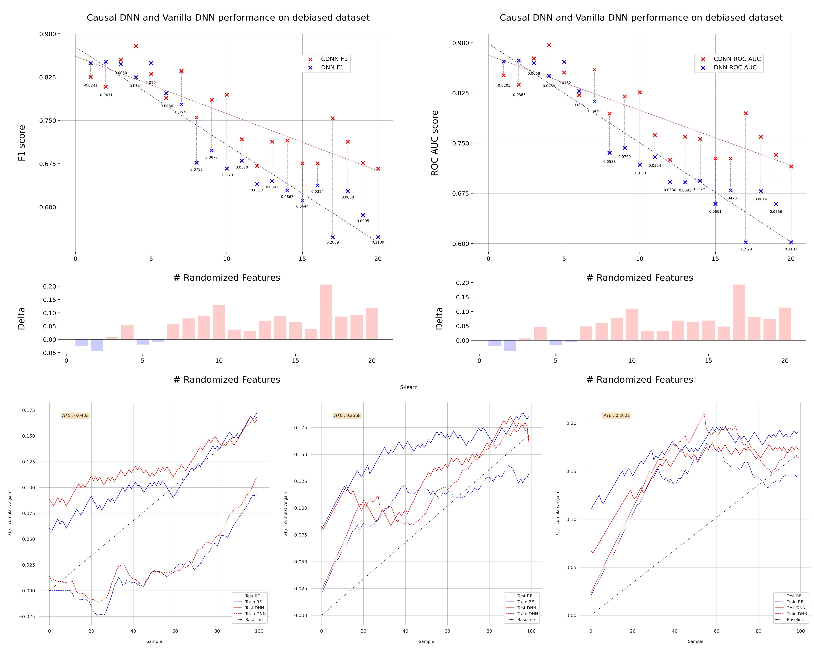

# Causal Hidden Markov Model (CHMM) - Replication Package

This repository contains datasets, pretrained models, and replication code for the paper:

"Enhancing Deep Learning Based IDS Adversarial Robustness With Causal Inference"

## Repository Structure

- `Pre-fitted HMM parameters (R)/`  
  Contains pre-fitted Hidden Markov Model (HMM) parameters.

- `Pre-trained MLP (PyTorch)/`  
  Includes both non-causal and causal Multi-Layer Perceptron (MLP) Intrusion Detection System (IDS) models.

- `Pre-trained Meta-Learners (PyTorch)/`  
  Stores meta-learners used for causal inference.

- `Sample dataset/`  
  Provides a dataset for replication and experimentation.

- `Replication-Code.ipynb`  
  Jupyter Notebook containing the replication code for implementing and evaluating the proposed algorithms.

- `_DeepCausality_`
  Our modified version of the DeepIDS network intrusion detection system, improved using our causal inference algorithm.

## Usage

1. Clone this repository
2. Load the pre-trained models from the respective directories or train new models using the provided dataset.
3. Run `Replication-Code.ipynb` to reproduce the experiments described in the paper.

## Results



## Citation

If you use this dataset, please cite the following works:

```
@article{francois2025causal,
  title={Unmasking Illusions: Enhancing Deep Learning IDS Adversarial Robustness With Causal Inference},
  author={François, Marin and Arduin, Pierre-Emmanuel and Merad, Myriam},
  journal={arXiv preprint},
  year={2025},
}
```
