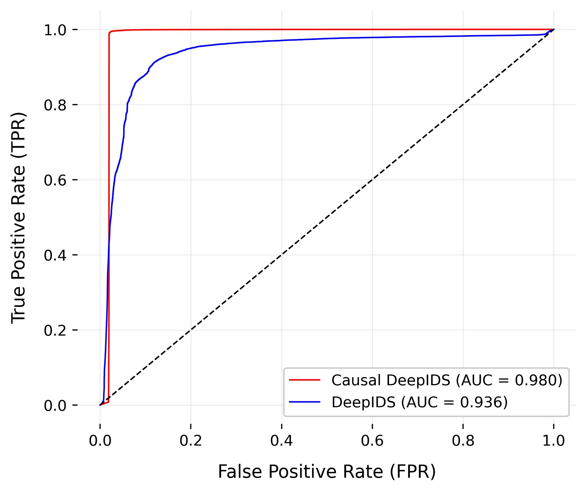

# DeepCausalityIDS - Replication Package

This repository contains replication material for the "DeepCausalityIDS" introduced in the paper "Unmasking Illusions: Enhancing Deep Learning IDS Adversarial Robustness With Causal Inference"
This neural network is a modified version of DeepIDS from the paper :

```
@article{tang2020deepids,
  title={DeepIDS: Deep learning approach for intrusion detection in software defined networking},
  author={Tang, Tuan Anh and Mhamdi, Lotfi and McLernon, Des and Zaidi, Syed Ali Raza and Ghogho, Mounir and El Moussa, Fadi},
  journal={Electronics},
  volume={9},
  number={9},
  pages={1533},
  year={2020},
  publisher={MDPI}
}
```

The original IDS has been modified and improved using out L2 Causal inference based algorithm. 

## Repository Structure

- **`_data_.tar.xz`** – Provides the dataset for replication and experimentation.
- **`_Preprocessing_.ipynb`** – Jupyter Notebook for data preprocessing.
- **`_DeepCausalityIDS_Replication_.ipynb`** – Jupyter Notebook containing the replication code for implementing and evaluating the proposed algorithms.
- **`Figures/`** – Directory containing key result visualizations.

## Usage
1. Clone this repository.
2. Extract the dataset from `data.tar.xz`.
3. Load the pre-trained models from `Pre-trained Models/` or train new models using the provided dataset.
4. Run `_DeepCausalityIDS_Replication_.ipynb` to reproduce the experiments described in the paper.

## Results
Below are two key ROC curve plots demonstrating the performance improvements:

### DeepIDS vs. DeepCausality-IDS



## Citation
If you use this repository or the methodology presented, please cite:

```
@article{francois2025causal,
  title={Unmasking Illusions: Enhancing Deep Learning IDS Adversarial Robustness With Causal Inference},
  author={François, Marin and Arduin, Pierre-Emmanuel and Merad, Myriam},
  journal={arXiv preprint},
  year={2025},
}
```
