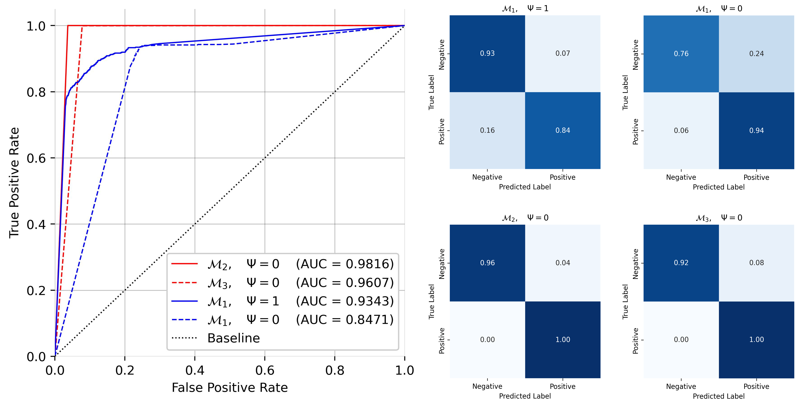

# PIGNN Replication Code and Dataset

This repository contains the dataset, preprocessing scripts, pretrained model weights, and replication code for the paper:

**"Physics-Informed Graph Neural Network for Attack Path Prediction"**

## Repository Structure

- `Exports/`  
  Contains the figures from the paper.

- `Weights/`  
  Stores the pretrained model weights, which can be loaded directly.

- `Preprocessing/`  
  Contains the dataset and preprocessing scripts. Please refer to `Preprocessing/README.md` for details.

- `PIGNN_Replication_Code.ipynb`  
  Jupyter Notebook with the replication code for building, training, and evaluating the models.

## Usage

1. Clone this repository
2. Extract the preprocessed dataset from `_data_.zip`.
3. Load the pretrained model weights from `Weights/` or train a new model using `PIGNN_Replication_Code.ipynb`.

## Results


## Citation

If you use this dataset or code, please cite the following works:

```
@article{francois2025physics,
  title={Physics Informed Graph Neural Networks for Attack Path Prediction},
  author={François, Marin and Arduin, Pierre-Emmanuel and Merad, Myriam},
  journal={arXiv preprint},
  year={2025},
}
```
